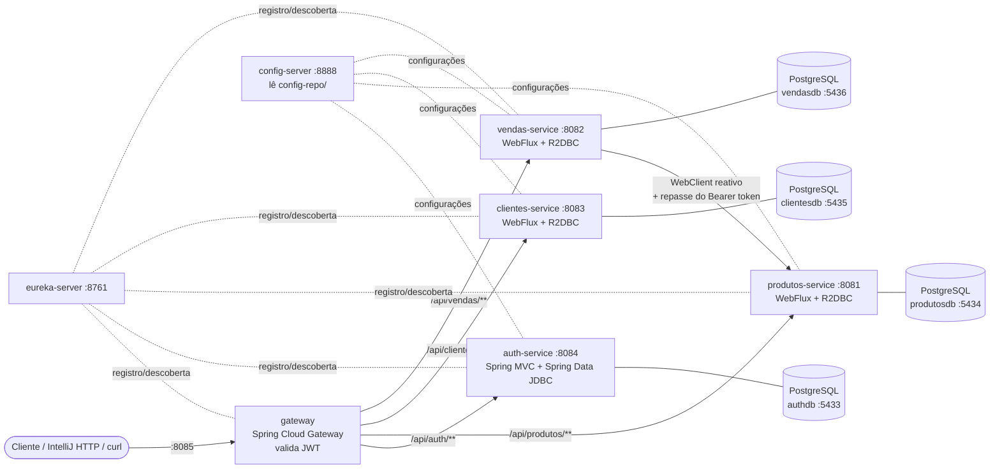

# API de Vendas: Microsserviços com autenticação JWT e Spring Reativo

Projeto derivado da branch `v9` de [brunowbbs2/api-vendas](https://github.com/brunowbbs2/api-vendas/tree/v9). Esta versão acrescenta:

- microsserviço de autenticação independente, com **JWT** (access token + refresh token);
- rotas protegidas em outros microsserviços;
- persistência com **Spring Data JDBC** (auth-service) e **Spring Data R2DBC** (serviços reativos);
- servidores reativos com **Spring WebFlux**;
- comunicação reativa entre serviços com **WebClient**;
- **um banco PostgreSQL separado para cada microsserviço**;
- testes automatizados com **Spring Boot + Testcontainers**.

---

## 1. Arquitetura



| Serviço | Porta | Stack | Banco | Responsabilidade |
|---|---|---|---|---|
| `eureka-server` | 8761 | Spring Cloud Netflix Eureka | — | Service discovery |
| `config-server` | 8888 | Spring Cloud Config (backend `native`) | — | Serve os arquivos de `config-repo/` |
| `gateway` | 8085 | Spring Cloud Gateway (WebFlux) | — | Porta de entrada única, roteamento `lb://` e validação do JWT |
| `auth-service` | 8084 | Spring MVC + **Spring Data JDBC** + jjwt | `authdb` | Cadastro, login, refresh e logout |
| `produtos-service` | 8081 | **WebFlux + R2DBC** | `produtosdb` | Catálogo de produtos |
| `clientes-service` | 8083 | **WebFlux + R2DBC** | `clientesdb` | Cadastro de clientes |
| `vendas-service` | 8082 | **WebFlux + R2DBC + WebClient** | `vendasdb` | Registro de vendas, consultando o produtos-service |

**Bancos separados (database per service):** cada microsserviço tem seu próprio container PostgreSQL. Nenhum serviço acessa o banco de outro. O vendas-service, por exemplo, obtém nome e preço do produto chamando a API do produtos-service via WebClient, e não o banco dele.

**Defesa em profundidade:** o token é validado no **gateway** e novamente em cada microsserviço protegido (um `WebFilter` reativo). Assim, chamar um serviço diretamente pela porta dele, sem passar pelo gateway, também exige token.

---

## 2. Tecnologia escolhida: JWT

A autenticação usa **JWT (JSON Web Token)** assinado com **HMAC-SHA256** (biblioteca `io.jsonwebtoken:jjwt 0.12.6`).

| Token | Validade | Claims | Uso |
|---|---|---|---|
| **Access token** | **2 minutos** | `iss=auth-service`, `sub=<email>`, `uid`, `nome`, `tipo=access`, `iat`, `exp` | Enviado no cabeçalho `Authorization: Bearer <token>` em toda rota protegida |
| **Refresh token** | **30 minutos** | `iss=auth-service`, `sub=<email>`, `jti=<uuid>`, `tipo=refresh`, `iat`, `exp` | Enviado **somente** para `POST /api/auth/refresh` |

Regras de segurança implementadas:

- **Rotação de refresh token:** cada `refresh` revoga o refresh token usado e emite um novo par. Reutilizar um refresh antigo retorna `401`.
- **Refresh token persistido:** o `jti` fica na tabela `refresh_token` (Spring Data JDBC), com expiração e flag `revogado`. Isso permite logout real.
- **Tipos não se misturam:** um refresh token não é aceito como access token nas rotas protegidas, e um access token não é aceito no endpoint de refresh.
- **Senhas com BCrypt.**
- **Resposta 401 padronizada** no gateway e nos serviços: `{"status":401,"erro":"Unauthorized","mensagem":"..."}`, com o cabeçalho `WWW-Authenticate: Bearer`.

O segredo (`jwt.secret`) é o mesmo no auth-service (que **assina**) e no gateway e nos serviços (que **verificam**). Ele fica em `config-repo/*.properties` e em `gateway/src/main/resources/application.properties`.

Usuária de demonstração criada automaticamente na primeira subida do auth-service:

| E-mail | Senha |
|---|---|
| `mariana.motta@al.infnet.edu.br` | `admin123` |

---

## 3. Como executar

### Pré-requisitos

- JDK 17 ou superior (testado com JDK 25);
- Docker Desktop **em execução** (para os bancos e para os testes com Testcontainers);
- IntelliJ IDEA (Maven já vem embutido) ou Maven 3.9+.

### Opção A: pelo IntelliJ (recomendado para a demonstração)

1. **File → Open** e selecione a pasta raiz do projeto (a que contém o `pom.xml` agregador). O IntelliJ importa os 7 módulos Maven.
2. Suba **somente os bancos** (os demais serviços do compose estão no profile `app` e não sobem com este comando):

   ```bash
   docker compose up -d
   ```

3. No seletor de execução do IntelliJ já aparecem as configurações da pasta `.run/`. Rode **nesta ordem**:
   1. **`A - Infra (eureka + config)`** e espere o log `Started ...` dos dois;
   2. **`B - Microsservicos + gateway`**.

   Se preferir, rode uma a uma: `1 - eureka-server`, `2 - config-server`, `3 - auth-service`, `4 - produtos-service`, `5 - clientes-service`, `6 - vendas-service` e `7 - gateway`.
4. Confira no painel do Eureka, em http://localhost:8761, que `AUTH-SERVICE`, `PRODUTOS-SERVICE`, `CLIENTES-SERVICE`, `VENDAS-SERVICE` e `GATEWAY` estão `UP`.

> A ordem importa: os microsserviços buscam porta, banco e segredo JWT no **config-server** ao subir. Se ele não estiver no ar, o serviço sobe sem configuração.

> **Windows:** as configurações de `.run/` e os `pom.xml` passam `-Djdk.net.unixdomain.tmpdir=<modulo>/target` para a JVM. Em algumas máquinas Windows (por exemplo, quando o nome do usuário tem espaço, como `C:\Users\GPS IT`) o Java não consegue criar o socket interno na pasta TEMP e falha com `Unable to establish loopback connection` ao abrir o Netty ou o Tomcat. Se criar uma configuração de execução nova no IntelliJ, copie essa VM option. Em Linux e macOS ela não tem efeito colateral.

### Opção B: tudo no Docker

```bash
docker compose --profile app up -d --build
```

Os serviços usam `restart: on-failure`: se algum subir antes do config-server, reinicia sozinho até conseguir. Para derrubar tudo:

```bash
docker compose --profile app down
```

Para apagar também os dados dos bancos:

```bash
docker compose --profile app down -v
```

### Testes automatizados

Com o Docker Desktop em execução:

```bash
mvn clean verify
```

Ou pelo IntelliJ: configuração **`Todos os testes`**, ou botão direito em `src/test/java` → *Run All Tests*.

| Módulo | Classe de teste | O que valida |
|---|---|---|
| auth-service | `UsuarioRepositoryTest` (`@DataJdbcTest` + Testcontainers) | Persistência com **Spring Data JDBC**: usuário, refresh token, revogação em lote |
| auth-service | `AuthControllerIntegrationTest` (`@SpringBootTest` + Testcontainers) | Cadastro, login, credenciais inválidas, refresh com rotação, reuso de refresh, logout |
| produtos-service | `ProdutoRepositoryTest` (`@DataR2dbcTest` + Testcontainers + `StepVerifier`) | Persistência reativa com **R2DBC** |
| produtos-service | `ProdutoControllerIntegrationTest` (`WebTestClient` + Testcontainers) | Rotas WebFlux: 401 sem token, token expirado, assinatura inválida, refresh usado como access, 200, 201, 404 |
| clientes-service | `ClienteRepositoryTest` / `ClienteControllerIntegrationTest` | R2DBC (incluindo unicidade de e-mail) e fluxo WebFlux protegido |
| vendas-service | `VendaRepositoryTest` (`@DataR2dbcTest` + Testcontainers) | Consultas reativas derivadas (por usuário e por produto) |
| vendas-service | `VendaFluxoIntegrationTest` (`WebTestClient` + Testcontainers + servidor HTTP falso do produtos-service) | Fluxo completo: **WebClient load-balanced** chamando o produtos-service, repasse do Bearer token, 201, 404, 400, 401 |
| gateway | `TokenFilterTest` | Rotas públicas liberadas, 401 sem token, token expirado ou adulterado, refresh recusado, cabeçalho `X-Usuario-Email` repassado |

Cada teste de persistência sobe um PostgreSQL 16 real em container (`@ServiceConnection`), com o mesmo `schema.sql` usado em produção.

---

## 4. Como realizar a autenticação

Todas as chamadas abaixo passam pelo **gateway (porta 8085)**.

**Login:**

```bash
curl -i -X POST http://localhost:8085/api/auth/login \
  -H "Content-Type: application/json" \
  -d '{"email":"mariana.motta@al.infnet.edu.br","senha":"admin123"}'
```

Resposta `200 OK`:

```json
{
  "accessToken": "eyJhbGciOiJIUzI1NiJ9...",
  "refreshToken": "eyJhbGciOiJIUzI1NiJ9...",
  "tokenType": "Bearer",
  "expiresIn": 120,
  "refreshExpiresIn": 1800
}
```

**Usando o token numa rota protegida:**

```bash
curl -i http://localhost:8085/api/clientes \
  -H "Authorization: Bearer <accessToken>"
```

**Cadastrando um novo usuário** (rota pública):

```bash
curl -i -X POST http://localhost:8085/api/auth/register \
  -H "Content-Type: application/json" \
  -d '{"nome":"Usuario Novo","email":"usuario.novo@vendas.com","senha":"senha123"}'
```

---

## 5. Como utilizar o endpoint de refresh

Quando o access token expira (2 minutos), as rotas protegidas passam a responder `401` com `"mensagem":"Token invalido ou expirado"`. Para obter um novo token **sem pedir a senha de novo**:

```bash
curl -i -X POST http://localhost:8085/api/auth/refresh \
  -H "Content-Type: application/json" \
  -d '{"refreshToken":"<refreshToken>"}'
```

A resposta tem o mesmo formato do login: **novo `accessToken` e novo `refreshToken`**. O refresh token enviado é **revogado**; guarde e use o novo nas próximas renovações. Se o refresh token estiver expirado, revogado, adulterado ou for na verdade um access token, a resposta é `401`.

Para encerrar a sessão, revogando todos os refresh tokens ativos do usuário:

```bash
curl -i -X POST http://localhost:8085/api/auth/logout \
  -H "Content-Type: application/json" \
  -d '{"refreshToken":"<refreshToken>"}'
```

---

## 6. Endpoints públicos

| Método | Rota (via gateway) | Descrição |
|---|---|---|
| POST | `/api/auth/register` | Cadastra um usuário. Body: `{nome, email, senha}`. Retorna `201` ou `409` se o e-mail já existe |
| POST | `/api/auth/login` | Autentica. Body: `{email, senha}`. Retorna tokens (`200`) ou `401` |
| POST | `/api/auth/refresh` | Renova os tokens. Body: `{refreshToken}`. Retorna tokens (`200`) ou `401` |
| POST | `/api/auth/logout` | Revoga os refresh tokens do usuário. Body: `{refreshToken}`. Retorna `204` ou `401` |

## 7. Endpoints protegidos (exigem `Authorization: Bearer <accessToken>`)

| Método | Rota (via gateway) | Serviço | Descrição |
|---|---|---|---|
| GET | `/api/produtos` | produtos-service | Lista os produtos |
| GET | `/api/produtos/{id}` | produtos-service | Busca um produto (`404` se não existe) |
| POST | `/api/produtos` | produtos-service | Cria um produto. Body: `{nome, preco}` |
| GET | `/api/clientes` | clientes-service | Lista os clientes |
| GET | `/api/clientes/{id}` | clientes-service | Busca um cliente |
| POST | `/api/clientes` | clientes-service | Cria um cliente. Body: `{nome, email}` (`409` se o e-mail repete) |
| GET | `/api/vendas` | vendas-service | Lista todas as vendas |
| GET | `/api/vendas/minhas` | vendas-service | Vendas registradas pelo usuário do token |
| GET | `/api/vendas/{id}` | vendas-service | Busca uma venda |
| POST | `/api/vendas` | vendas-service | Registra uma venda. Body: `{idProduto, quantidade}`. Consulta o produtos-service via **WebClient**, repassando o token |

Sem token, com token expirado, adulterado ou com refresh token no lugar do access token, qualquer rota acima retorna `401 Unauthorized`.

---

## 8. Roteiro de demonstração e exemplos de requisições

O arquivo **[`requests.http`](requests.http)** roda direto no IntelliJ: abra o arquivo e clique no ▶ ao lado de cada requisição. Ele guarda `accessToken` e `refreshToken` automaticamente entre as chamadas. A sequência cobre todos os itens da avaliação:

| # | Demonstração | Requisição | Esperado |
|---|---|---|---|
| 1 | Tentativa de acesso sem autenticação | `GET /api/clientes` sem cabeçalho | `401` |
| 2 | Rejeição de credenciais inválidas | `POST /api/auth/login` com senha errada | `401` |
| 3 | Autenticação com sucesso e obtenção do token | `POST /api/auth/login` | `200` + tokens |
| 4 | Acesso a rota protegida com o token | `GET /api/clientes` com Bearer | `200` |
| 5 | Uso do endpoint de refresh | `POST /api/auth/refresh` | `200` + novo par |
| 6 | Novo token obtido via refresh funcionando | `GET /api/produtos` com o novo Bearer | `200` |
| 7 | Refresh antigo (rotacionado) rejeitado | `POST /api/auth/refresh` com o token antigo | `401` |
| 8 | Refresh token usado como access token | `GET /api/clientes` | `401` |
| 9 | Token adulterado | `GET /api/clientes` | `401` |
| 10 | Venda com WebClient entre serviços | `POST /api/vendas` | `201` |
| 11 | Venda com produto inexistente | `POST /api/vendas` com `idProduto` 9999 | `404` |
| 16 | Serviço acessado direto, sem gateway e sem token | `GET http://localhost:8083/api/clientes` | `401` |

Para mostrar a **expiração** ao vivo: faça o login, espere mais de 2 minutos, repita a requisição 4 (vai dar `401`), rode a 5 (refresh) e repita a 4 (volta a dar `200`).

Equivalente em `curl` (Git Bash):

```bash
curl -s -o /dev/null -w "%{http_code}\n" http://localhost:8085/api/clientes

TOKENS=$(curl -s -X POST http://localhost:8085/api/auth/login -H "Content-Type: application/json" -d '{"email":"mariana.motta@al.infnet.edu.br","senha":"admin123"}')
ACCESS=$(echo "$TOKENS" | sed -E 's/.*"accessToken":"([^"]+)".*/\1/')
REFRESH=$(echo "$TOKENS" | sed -E 's/.*"refreshToken":"([^"]+)".*/\1/')

curl -s http://localhost:8085/api/clientes -H "Authorization: Bearer $ACCESS"

curl -s -X POST http://localhost:8085/api/auth/refresh -H "Content-Type: application/json" -d "{\"refreshToken\":\"$REFRESH\"}"

curl -s -X POST http://localhost:8085/api/vendas -H "Authorization: Bearer $ACCESS" -H "Content-Type: application/json" -d '{"idProduto":1,"quantidade":2}'
```

---

## 9. Estrutura do projeto

```
.
├── pom.xml                  agregador Maven (abre tudo no IntelliJ)
├── docker-compose.yml       4 PostgreSQL (padrão) + serviços (profile "app")
├── requests.http            roteiro de demonstração para o IntelliJ
├── .run/                    configurações de execução do IntelliJ
├── config-repo/             configurações servidas pelo config-server (local e profile docker)
├── eureka-server/
├── config-server/
├── gateway/                 rotas /api/** + TokenFilter (validação JWT)
├── auth-service/            JWT + Spring Data JDBC (usuario, refresh_token)
├── produtos-service/        WebFlux + R2DBC
├── clientes-service/        WebFlux + R2DBC
├── vendas-service/          WebFlux + R2DBC + WebClient -> produtos-service
└── k8s/                     manifestos Kubernetes da versão anterior (v9)
```

Versões: Spring Boot **4.1.0**, Spring Cloud **2025.1.2**, Java **17** (bytecode), PostgreSQL **16**, Testcontainers **2.0**.

---

## Documentação da versão anterior (v9)

- [Documentação Microserviços](https://claude.ai/code/artifact/2c541174-0b49-486d-9ee2-1682e91b8daf)
- [Documentação implementação Docker GUIA](https://claude.ai/code/artifact/a5f3c8e5-81de-4791-a16c-a71d4aa45f0f)
- [Documentação implementação Kubernetes GUIA](https://claude.ai/code/artifact/68cd2944-af3d-430f-8e6f-ea27c4186982)
